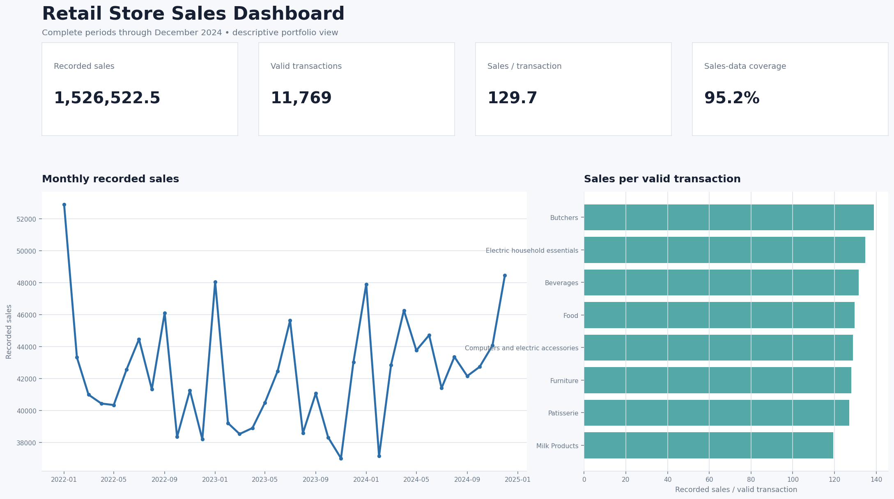

# Retail Store Sales Analysis

Portfolio case study using Python, SQL, statistical testing, and an interactive dashboard to turn 12,575 retail records into decision-focused insights.



> **Publication status:** the project owner confirmed that the included files are cleared for public release. The original dataset source URL and named license were not supplied; add them to [DATA_SOURCE_AND_LICENSE.md](docs/DATA_SOURCE_AND_LICENSE.md) if available.

## Business objective

The project answers four practical questions:

1. How much recorded sales activity is available and how complete is it?
2. Do transaction values differ meaningfully across categories, channels, payment methods, or recorded discount states?
3. Which apparent patterns are large enough to support a business decision?
4. Can an early transaction-value benchmark outperform a simple baseline without using target-derived information?

The analysis is observational. It does not claim that category, channel, payment method, or discount status causes transaction value.

## Dataset

| Measure | Value |
|---|---:|
| Records | 12,575 |
| Date range | 2022-01-01 to 2025-01-18 |
| Customers | 25 |
| Categories | 8 |
| Items | 200 |
| Channels | Online and In-store |
| Records with observed sales | 11,971 |
| Sales-data coverage | 95.20% |
| Unknown discount states | 4,199 (33.39%) |

Both the supplied raw CSV and the reproducible cleaned CSV are included.

See the complete [data dictionary](docs/data_dictionary.md).

## Tools

- **Python 3.12:** cleaning, validation, statistical analysis, modeling, and report generation
- **pandas / NumPy:** transformations and aggregation
- **SciPy:** non-parametric tests and categorical association tests
- **scikit-learn:** time-aware preprocessing and Ridge benchmark
- **SQL:** decision-focused analytical queries
- **HTML / CSS / JavaScript:** standalone interactive dashboard
- **unittest:** automated data and leakage-control checks

Exact versions are pinned in [`requirements.txt`](requirements.txt).

## Cleaning process

The cleaning strategy preserves uncertainty rather than hiding it:

- Standardized whitespace, dates, and discount labels.
- Preserved missing discounts as `Unknown` instead of converting them to `No`.
- Derived 609 missing prices using `Total Spent ÷ Quantity` and flagged them.
- Internally inferred 1,213 items only when category and price mapped to one item.
- Left 604 quantities and totals missing because both were absent.
- Flagged 60 high-value IQR records without deleting or winsorizing them.
- Preserved all 12,575 rows.
- Verified complete and unique transaction IDs.
- Added imputation, arithmetic, outlier, and missing-pattern audit fields.

The portable cleaning script also records a SHA-256 hash before and after execution to verify that the raw input was not modified.

### Important modeling safeguard

Internally inferred items are acceptable for disclosed descriptive summaries, but some were inferred through a target-derived price. The leakage-safe benchmark masks every inferred item as unavailable:

```text
Total Spent → derived Price → inferred Item → prediction
```

## Analysis methodology

### Descriptive analysis

- Recorded sales and sales-data coverage
- Valid transactions and units sold
- Sales per valid transaction
- Channel and category comparisons
- Complete-month time trend
- Product ranking with minimum-sample safeguards
- Missingness and imputation diagnostics

### Statistical analysis

- Kruskal–Wallis tests for transaction-value distributions across groups
- Mann–Whitney U for known recorded discount states
- Spearman correlation for price–quantity association and monotonic time trend
- Chi-square tests with bias-corrected Cramér's V
- Benjamini–Hochberg false-discovery-rate adjustment
- Customer-cluster bootstrap interval for the Online minus In-store mean difference

P-values are interpreted with effect sizes. Non-significance is not described as proof that groups are equal.

### Experimental modeling extension

The benchmark estimates `Total Spent` after product and channel are known but before quantity and final total are recorded.

- Chronological training/holdout split
- Three-fold `TimeSeriesSplit` inside the training period
- Ridge alpha selected using training-period validation only
- One final evaluation on the untouched chronological holdout
- Price, quantity, customer ID, payment method, discount status, transaction ID, and audit flags excluded
- All internally inferred items masked as `Unknown_at_prediction`

The prediction moment has not been established as a valuable business workflow, so the model is an experimental portfolio extension—not a deployment recommendation.

## Key findings

### 1. Sales coverage is high but incomplete

11,971 of 12,575 records contain observed sales values, giving **95.20% coverage**. Revenue-related summaries exclude 604 unresolved records and always display their denominator.

### 2. Category differences are statistically detectable but commercially small

The category test produced `p < 0.001`, but epsilon-squared was approximately **0.003**. Category explains negligible practical separation in transaction-value ranks.

### 3. Channel and payment differences were not detectable

After false-discovery-rate adjustment:

- Channel comparison: adjusted `p ≈ 0.582`
- Payment-method comparison: adjusted `p ≈ 0.582`

The customer-cluster bootstrap estimate for Online minus In-store mean transaction value was approximately **1.56**, with a 95% interval spanning roughly **-2.0 to 4.7**.

### 4. Discount effectiveness cannot be evaluated

One-third of discount states are unknown, the discount amount is absent, and `Total Spent` equals price multiplied by quantity even when a discount is recorded. The project therefore makes no promotion-effect claim.

### 5. No reliable monotonic sales trend was detected

Across 36 complete months, Spearman `ρ ≈ 0.180` with `p ≈ 0.293`. This does not rule out seasonal or nonlinear change.

### 6. Corrected benchmark performance is modest and uneven

| Holdout metric | Ridge benchmark | Median baseline |
|---|---:|---:|
| MAE | 59.59 | 76.12 |
| RMSE | 75.22 | 96.82 |
| R² | 0.368 | -0.047 |

The model improved MAE by approximately **21.7%** on this holdout, but performance was poor where item identity was genuinely unavailable:

- Original-item rows MAE: **58.51**
- Item-unavailable rows MAE: **81.66**
- Highest-value decile MAE: **131.23**

These subgroup results are why the model is not presented as deployment-ready.

## Evidence-based recommendations

| Recommendation | Supporting finding | Expected benefit | Priority | Potential risk | Success measure |
|---|---|---|---|---|---|
| Define `Total Spent` as gross or net and document treatment of tax, returns, refunds, and discounts. | Recorded totals equal price × quantity even when a discount is marked `Yes`; currency and sales semantics are absent. | Prevents incorrect revenue and promotion conclusions. | Critical | Historical fields may not be recoverable. | 100% of new records pass a documented reconciliation rule; metric definition is approved by the data owner. |
| Capture discount amount/rate and a reliable promotion identifier. | 4,199 discount states (33.39%) are unknown, and no discount magnitude is available. | Enables defensible promotion measurement and margin analysis. | High | Added entry burden or inconsistent promotion coding. | Unknown discount state below 2%; discount amount reconciles to net sales on at least 99% of eligible records. |
| Add automated completeness monitoring for quantity and total. | 604 records lack both fields, reducing sales coverage to 95.20%. | Improves reporting coverage and makes missingness visible before analysis. | High | Teams may optimize the completeness score without improving accuracy. | Monthly observed-sales coverage at or above 99%, with exception counts reviewed and resolved. |
| Keep partial months out of default period comparisons. | January 2025 ends on the 18th; including it as a full month would bias trend comparisons downward. | Avoids false deterioration alerts and misleading month-over-month comparisons. | High | Users may still export unadjusted partial periods. | Dashboard defaults and tests always label/exclude partial periods; zero unlabeled partial-month comparisons. |
| Use customer-clustered or mixed-effects methods for confirmatory inference. | 12,575 rows come from only 25 repeating customer identifiers, so row-level independence is weak. | Produces uncertainty estimates that better reflect the sampling structure. | Medium | With 25 clusters, intervals can remain unstable. | Confirmatory results report cluster-aware intervals and cluster counts; conclusions are unchanged under sensitivity checks. |
| Validate insights on a later period or independent retail dataset before operational use. | The data covers one supplied dataset, appears highly engineered, and has no external validation. | Tests whether findings generalize beyond this sample. | High | A new sample may reveal weaker or different patterns. | Predefined KPIs and effect estimates are reproduced within agreed tolerances on independent data. |
| Keep the predictive benchmark experimental until a real decision and action are defined. | Holdout MAE improved 21.7% over baseline, but item-unavailable MAE is 81.66 and top-decile MAE is 131.23; no deployment workflow is established. | Prevents deploying a model with unclear value and uneven risk. | Medium | Delaying deployment can postpone learning. | A documented decision owner, intervention, cost matrix, acceptance threshold, and prospective evaluation exist before deployment. |
| If modeling continues, monitor errors by spend band, item availability, and time. | Aggregate MAE 59.59 hides materially worse errors for unavailable items and high-value transactions. | Detects harmful performance gaps that one average metric conceals. | High | Small subgroups can create noisy alerts. | Subgroup MAE and coverage are tracked each period; thresholds trigger review and no critical group exceeds its agreed limit. |

## Interactive dashboard

Open [`dashboard/index.html`](dashboard/index.html) in a browser.

The dashboard provides:

- Start/end month filters
- Channel and category filters
- Previous equal-length period comparisons
- Recorded sales, valid transactions, sales per transaction, and coverage
- Monthly sales trend
- Category breakdown with quantity-coverage context
- Explicit partial-month handling

Regenerate it with:

```bash
python src/build_dashboard.py \
  --input data/processed/retail_store_sales_cleaned.csv \
  --output dashboard/index.html
```

## SQL analysis

[`sql/analysis.sql`](sql/analysis.sql) contains SQLite-compatible examples for:

- Monthly channel performance and coverage
- Top products with minimum sample thresholds
- Missing-sales rate by category
- Customer-level summaries
- Month-over-month change using a window function

## Repository structure

```text
.
├── README.md
├── Makefile
├── requirements.txt
├── runtime.txt
├── .github/
│   └── workflows/ci.yml
├── assets/
│   └── dashboard-preview.png
├── dashboard/
│   ├── index.html
│   └── template.html
├── data/
│   ├── README.md
│   ├── raw/
│   │   └── retail_store_sales.csv
│   └── processed/
│       └── retail_store_sales_cleaned.csv
├── docs/
│   ├── DATA_SOURCE_AND_LICENSE.md
│   ├── data_dictionary.md
│   └── original_cleaning_script.py
├── reports/
│   ├── generated/
│   └── original/              # archived pre-audit reports; see its README
├── sql/
│   └── analysis.sql
├── src/
│   ├── build_dashboard.py
│   ├── clean_data.py
│   ├── create_preview.py
│   ├── statistical_analysis.py
│   ├── train_model.py
│   └── validate_data.py
└── tests/
    ├── dashboard_runtime_check.js
    ├── test_cleaning_reproduction.py
    ├── test_cleaned_data.py
    └── test_sql.py
```

## Reproduce the project

### 1. Create the environment

```bash
python -m venv .venv
```

```bash
# macOS / Linux
source .venv/bin/activate

# Windows PowerShell
.venv\Scripts\Activate.ps1
```

```bash
pip install -r requirements.txt
```

### 2. Run all included analytical stages

```bash
make all
```

Or run each stage directly:

```bash
python src/validate_data.py \
  --input data/processed/retail_store_sales_cleaned.csv \
  --output reports/generated/validation_summary.json

python src/statistical_analysis.py \
  --input data/processed/retail_store_sales_cleaned.csv \
  --output reports/generated/statistical_analysis.json

python src/train_model.py \
  --input data/processed/retail_store_sales_cleaned.csv \
  --output reports/generated/leakage_safe_model.json

python -m unittest discover -s tests -v
node tests/dashboard_runtime_check.js
```

### 3. Reproduce cleaning from raw data

The supplied raw file is included at `data/raw/retail_store_sales.csv`. See [`data/README.md`](data/README.md) for its publication notes.

```bash
python src/clean_data.py \
  --input data/raw/retail_store_sales.csv \
  --output data/processed/retail_store_sales_cleaned.csv \
  --log reports/generated/cleaning_log.json
```

## Automated checks

The included tests verify:

- Expected dataset shape
- Full cell-level reproduction of the cleaned dataset from the supplied raw CSV
- Complete and unique transaction IDs
- Known missingness and audit counts
- Price × quantity arithmetic consistency
- Validation-module checks
- Masking of all internally inferred items before modeling
- Dashboard initialization, filtering, partial-period handling, comparison logic, and reset behavior
- Execution of all portfolio SQL queries in an in-memory SQLite database
- GitHub Actions checks on every push and pull request

## Limitations

- The original dataset source URL and named license were not supplied, although the project owner cleared the included files for public release.
- Only 25 customer identifiers appear repeatedly; rows are not fully independent.
- The data structure appears synthetic or highly engineered and may not represent a real retailer.
- Currency and gross/net sales definitions are unavailable.
- Discount amount, costs, profit, returns, refunds, traffic, promotions, and inventory are unavailable.
- Missingness cannot be proven to be completely random.
- January 2025 is incomplete.
- Rare items have unstable rankings.
- The model has no external, new-customer, or price-change validation.

## Responsible use

Use the project as an exploratory portfolio analysis. Do not use it to claim causal effects, estimate discount impact, forecast company performance, or deploy transaction-level predictions without resolving the documented data and validation limitations.
